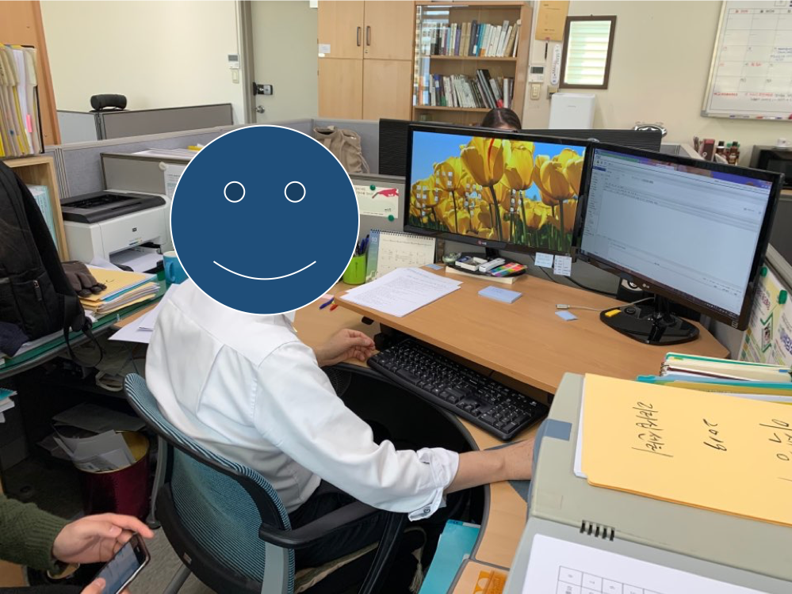
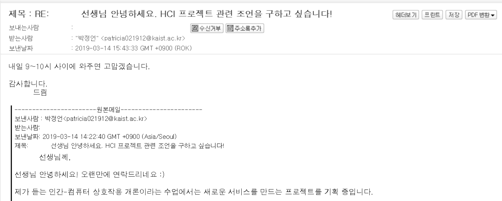
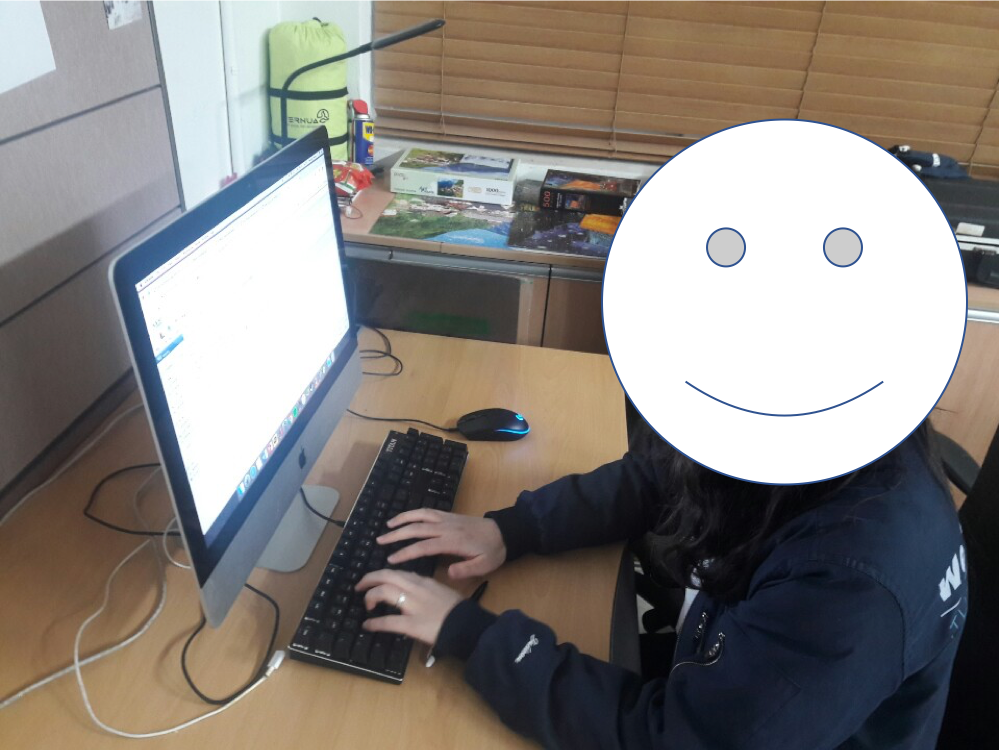

**Team. PoZangZee**  
Jeongeon Park, Changhyeon Park, Juan Lee, Hyunchang Oh  
2019 Spring, CS374 Introduction to HCI

# DP1. Needfinding

## Experience
Redesign heavy Email users’ experience of more efficient email using.  
> The definition of *heavy users* is those whose occupation will be significantly disturbed if do not send emails

## Observations & Interviews

### Interviewees
The common criterion was that they send a lot of emails.
* Appointed by email, met at office

-----

  
**A Staff in KGLC**: *Jeongeon, Changhyeon, Hyunchang*
* Organises leadership programs (courses, lectures, tours, etc.)
> * Interview took place in the KGLC office.
> * Main recipient groups are Student Lecturers for Leadership Program III/ various bureaus and sections of the school administrative office / Lecturers for other leadership programs
> * Categorizes & Manages the students related with leadership programs into a few recipient groups 
> * Uses same format for every time when he send similar contents to other people.
> * Suggested ‘It would be useful if I could store the frequently used email formats in a special mailbox’
> * Confessed that he has made mistakes when receiving individual replies from a big recipient group

-----

  
**A Staff in IRT**: *Jeongeon, Juan*  
*extreme user: more than 70 groups in mailbox, sends more than 20 emails every day*
* Frequent interactions with international students and partner colleges
> * Interview took place in the IRT office
> * Sends 70% emails in English, 30% emails in Korean
> * Uses two main emails, and one sub email > has the two email screen open at all times (one with Chrome and the other with IE - which was very interesting)
> * Taught us the “individual sending” function, has made few mistakes when he/she began to work
> * Greeting formats differ for the status of the recipients, often shorter for students than partner colleges and professors
> * Uses the forwarding function to urge email replies

-----

  
**A Staff in KAIST Herald**: *Jeongeon*
* Asks for Interviews and materials for newspaper, receives and replies to voices of the people
> * Interview took place in the KAIST Herald room
> * Sends 20% of emails in English, 80% of emails in Korean
> * Main sending groups are professors / the school administrative office / friends / KAIST people
> * Not very confident with Korean, especially when writing greeting messages in Korean
> * Uses an old computer > wanted auto saving system because of the network matters
> * Talked in details about comparing Korean and English emails, about how English emails are more wordy but easier to write, whereas Korean Emails are more concise but harder to choose the right formality

-----

  
**A Staff in KAIST Times**: *Jeongeon, Changhyeon, Juan*
* Requests interviews and materials for newspaper via emails
> The most common purpose of using emails during work was to request for travel expenses as he has to cover important events within the country. The burden here was the school required a lot of information along with extensive formatting. How he dealt with the issue was to save the previously sent emails to MS Word document and use them as a format for next emails. However, because there are lots of details, he commented that it not only took effort, but also caused many errors.

### Questions Arose During the Course of Interview
* **Q0**: Show me your mailbox and how you write your emails.  
* **Q1**: Do you have formats?  
* **Q2**: How do you distinguish important emails from garbages?  
* **Q3**: Who do you send your emails to, how do you manage them into groups?  
* **Q4**: How do you cope with re-re-re-re-replies, and those who never reply?  
* **Q5**: Any other inconveniences?   
* **Other questions**: What do you do if someone does not reply an urgent email you sent? / What was the most serious mistake you made using group emails? / How do you manage multiple accounts at once? / How are emails in Korean and emails in English different in your own view?

## Interesting Moments
* Extensive Grouping
* Formats were Necessary for Those with Lower Social Status
* Uses IE for accounts other than the main one on Chrome
* *“Do you not forget to write emails?”* *“Yes, I just did (left to write an email)”*
* Prefers emails for recordkeeping purposes
* Ctrl C + Ctrl V for mails that require formats
* KAIST email supports ‘individual sending’ to conceal the entire list of recipients to recipients.
* KAIST email is actually better than you might have thought.

## Needs
* Time consuming to copy and paste the same greeting all the time
* Have to log in and out to send mails from different accounts
* Wish to see multiple emails at once
* Formalistic coats make you put more time to get what it is actually all about
* **Manage re-re-re-re-re conversations**
* **Make the send button more safer**
* Liberate your creativity from strict and prohibitive email formats (e.g. Tables, images)
* Individual Sending Function is hard to find despite of its importance 
* Manage the emails that constantly leaks out from your memory
* **Have to change the mail title all the time manually even when the only thing altered is the recipient’s name (e.g. Dear…) and similarly with repeating questions, etc.**

## Insights

* Formalism does not decrease efficiency of heavy users than we first expected
* **Still, heavy users require formats which built by copy and paste.**
* Grouping functions (mailboxes, recipient groups, etc.) were heavily used.
* **The norm was to use many email accounts at once.**
* Experts make mistakes frequently (forget to reply, send incomplete emails, etc.)
* Users do not need formats every time, even for official and long mails.
* **Users preferred concise emails to fancy and redundant ones.**
* KAIST mail checks if the mail is read and tells the user that sent it--a function that is very welcomed by the users.
* **KAIST mail is better than we thought.**
* Users often call the recipient if an important email is not read.

# Feedback of DP1. Needfinding
Overall Reflection: Going through the whole feedback, quite a lot of people questioned about the details of the presentation. For the efficient delivery of our presentation, we can concentrate on the points we thought are important from next time.
A lot of people had an interest in the re-re-re emails and the comparison between Gmail and KAIST email. It was also nice to see people telling us the functions of Gmail we did not realize. There were also ideas that we had not thought about - such as mobile emails and visualizing the number of re’s.

## Feedback from Studio
**People liked …**
* how you use re-re-re instead of multiple reply. [+2]
* Good idea since I also felt lots of problems in preexisting mail systems.
* You found the need to functionality to see multiple emails at once.
* that you found some interesting needs from using the Kaist email.
> Thank you! We also love our topic as of now :)

**People wished ...**
* you could explain more about how KAIST email would be better than we thought [+3]
> We tried to emphasize how the KAIST email was very useful to the target users, but during the presentation, we did not have enough time to explain in details the things that were good about the KAIST email. This insight arose when we were interviewing the KAIST Herald Staff when she asked us the question, “which one is better, Gmail or KAIST email?” KAIST email has a very simple look, which increases the learnability of the users. It also has functions such as “checking the time the reader read the email” or “individual sending” which was useful for heavy email users to communicate more efficiently with others. Also, simply comparing the UI of Gmail and KAIST email, Gmail lacked a little in terms of learnability such as hard to find the delete button, re-re-re messages being stored in both “Sent” and “Inbox”.
* could you explain about “liberate creativity”?
> The email platforms we encountered during the interviews often provided the email input interface in a way that limits the freedom of format. One pronounced example was that an image may not be placed amid text if its file size is larger than a set value. This may enhance the transmission efficiency, but it is often necessary to keep the position of the image in the text. We acknowledge ‘liberate creativity’ may not be the best expression for such discoveries, and should better have just elaborated on the issue.
* that you could look into how they keep email template texts.
> We have looked into the email template texts of the interviewees and how they utilise them for new emails. The most common way we noticed was to write them on a separate text processor (Microsoft Word or Hangul). However, they did not save them as files as they were only necessary for the current set of emails they send to a group of recipients. When they had to refer to past templates, they visited the old mailbox and found the old emails to retrieve the templates.

**What if ...**
* If the mail reaches a certain number of replies, it turns into a messenger-like interface
> This is a great idea! We personally like this idea, and it seems similar to Gmail interface in some way. Thank you for suggesting.
* the users just used Microsoft Outlook? Outlook provides possibility of showing multiple email accounts, and BCC email-sending (Blind Carbon Copy).
> Think you for bringing this interesting issue. We are now focusing on the heavy email users regardless of the mail vendor. It is great if Outlook supports multiple accounts, however, we can support many other things even for Outlook users. For example, help manage many recipients at once, manage mailboxes efficiently, write formatted mail, etc.
* Show the number of re:
> We are grateful for your suggestion. One of the issues that have been raised during our internal discussion was that, as replies are sent back and forth for a single thread of information, it is not necessary to keep the ‘mail’ metaphor that email tried to take in the first place. It may better correspond with the ‘conversation’ metaphor that is frequently adopted in messenger applications. During the interviews, we have also noticed that formalism tends to drop as the conversation gets longer. Using this fact, we are considering the adaptation of a more messenger-like interface for prolonged conversations. Whether this would turn out to be a good idea is to be discovered in future developments.
* Finding out problems in mobile E-mail.
> We just focused on the web E-mail system, and your suggestion was also acceptable. We set our target user group as heavy E-mail users, so they mainly use web E-mail systems and that’s why we didn’t think about mobile E-mail.

**And others**
* I just wonder about why they want to make the send button more “safer”? Is there any examples? [+1]
> We meant all the cases the sender mistakenly sends an email. For example, a sender may send incompleted mail if a recipient is already written or may send without checking individual sending option.
* I’ve heard that gmail also have the function that tells you whether the receiver have read your email if it’s an organization gmail or something.. But I understand how KAIST email could be more convenience! Nice Pickup.
* A small fact: Gmail also has a undo button for email that has been sent (if the user immediately tries to unsend)