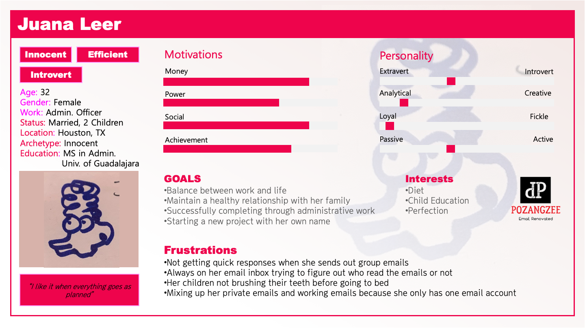
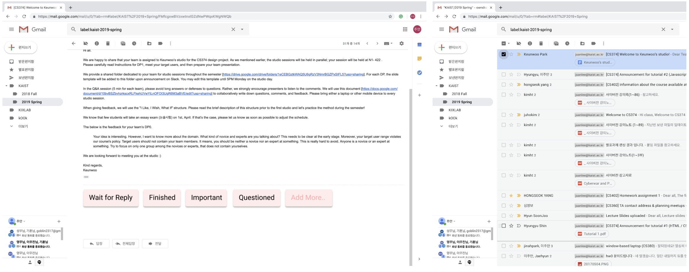
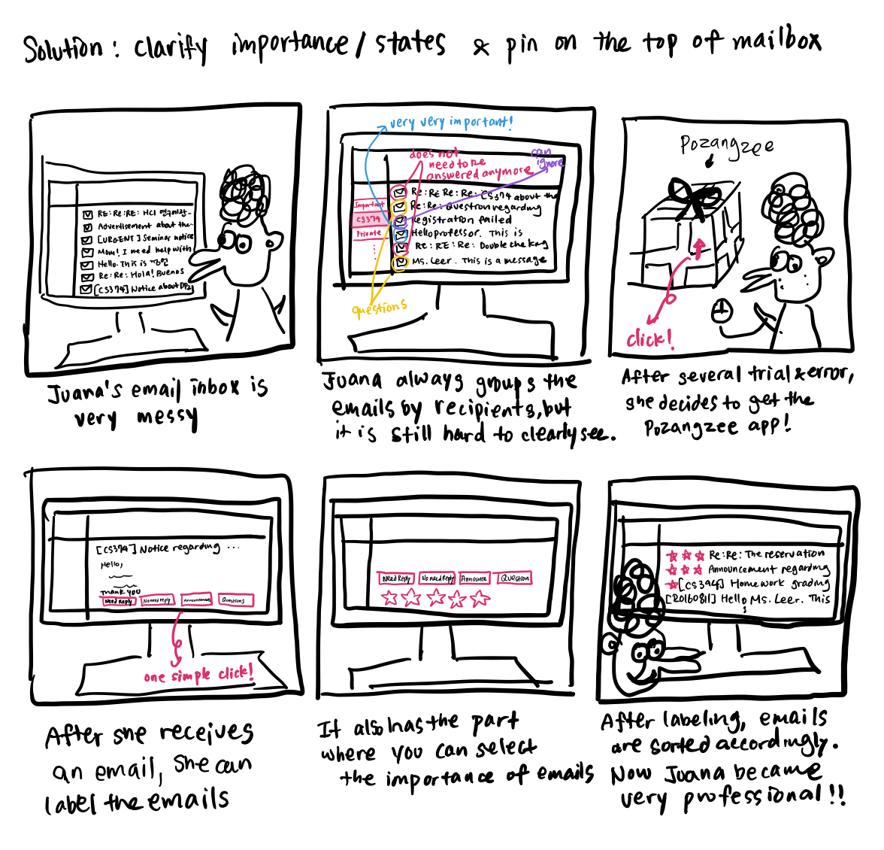
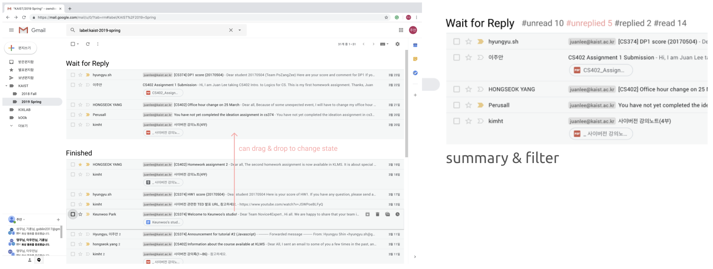
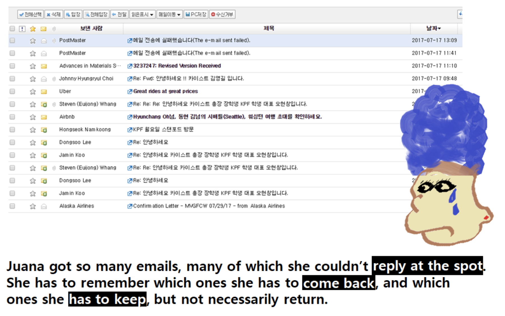
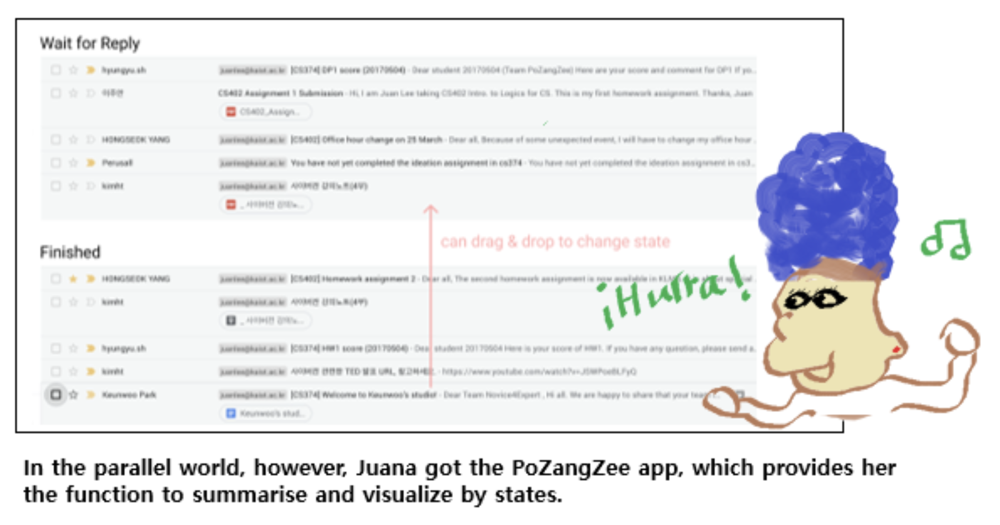
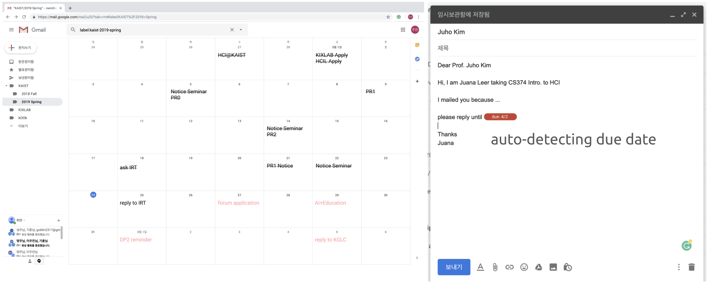
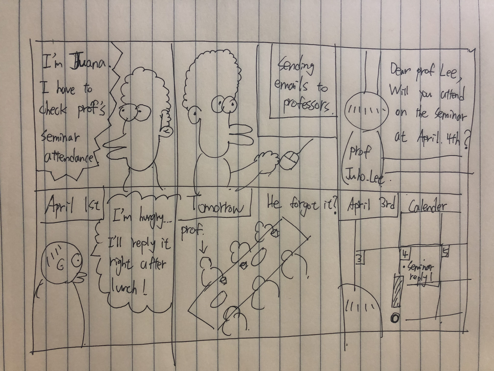
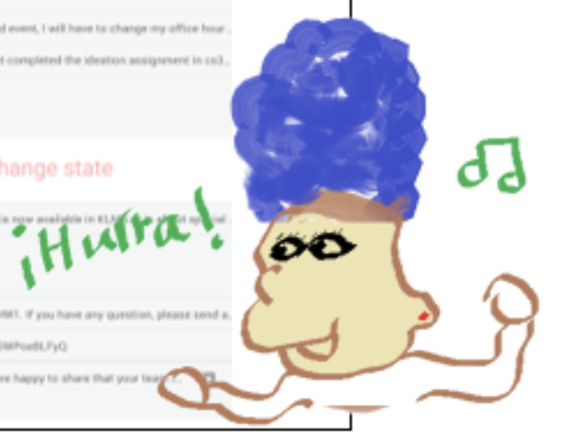

  
**Team. PoZangZee**  
Jeongeon Park, Changhyeon Park, Juan Lee, Hyunchang Oh  
2019 Spring, CS374 Introduction to HCI

# DP2. Ideation

## POV and Persona
**Heavy email users** need to **better organise replies** because:
1. when the same mail is sent to many people, and many replies come back as individual emails, it will be **time consuming** to take note of all of them;
2. **replies** may be just simply a ‘Thank you’, or an important and urgent inquiry. The former requires no reply, while the latter requires immediate attention.
3. repeated replies may develop into a long conversation, and be coordinated with other users (probably as cc.) and it will be **difficult to keep track of the flow** of information in such situations.
> The definition of heavy email users is those whose occupation will be significantly disturbed if do not send emails

## Persona, Juana Leer
> Encantado, Juana  

## Top 3 HMW Questions & others
* **How** we chose the Top 3 HMW Questions
  * Re-thinking about the interviews and the interviewees’ needs
  * If it is manageable / feasible

1. HMW mark the **level of importance** for each email?
  * Because it is **difficult to notice how important** the received email is with the linear mailbox interface. Marking the level of importance in some way might help efficient email managing.

2. HMW **visualize everything** such as recipient, time, date, etc?
  * Because interviewees had difficulties in **overviewing the individual replies**, so they often missed replying to some of their emails. Visualizing overall states might be helpful.

3. HMW make sure replies come back **on time**?
  * Because **time managing** is an important issue for heavy email users since they are usually organizing or noticing something important. Thus, ensuring the replies might work.

**the others are...**
* HMW provide incentives for opening mails or reading them?
* HMW educate profs to send replied individually?
* HMW make interface just like messenger?
* HMW make the "re" into an icon more easily distinguished?
* HMW call the recipients automatically & read the emails?
* HMW not support group sending?
* HMW support different formats for each groups?

## Top 3 Solution Ideas
1. **Classify importance or states** of conversation and **pin on the top of mailbox**
2. **Summarize and Visualize by states and inform** important, unread, etc.
3. Make email system like **monthly scheduler** with due date not received date

### How we chose them
1. If it is feasible
2. If different solutions cover different areas
3. If the solutions are not solution-driven but more problem-driven

### Solution 1
**Classify importance or states** of conversation and **pin on the top of mailbox**

**other possible solutions are...**
* Use ★★★★★ scale instead of just ★
* From whom the message is sent
* Show unread emails on the top
* Auto archive the read, old emails (unimportant)
* Resize individual emails by the importance and date
* Automatically categorize by ★s
* Add “priority” option to mail protocol
* Marks ★s if the mail has some keywords that user has set up manually.
* Seperate the mail list into two: One has normal ones, another has important ones. 

#### Storyboard #1
  
The main focus of this solution was that the users, after receiving the email, can label the state/importance at the instant. This will be efficient because the extra time used for labeling will be just a few seconds.

### Solution 2
* **Summarize and Visualize by states and inform** important, unread, etc.

**other possible solutions are...**
* Use colors for categories just like the calendar app “TimeBlocks”
* Show picture instead of email address. social pressure
* Badge next to your email (ex. xxx@kaist.ac.kr ♧)
* Put pictograms as a summary on the bottom
* Organize emails to visualize how frequently emails are sent in between departments (ex. thickness of the line)
* Make email system like monthly scheduler and users can check each day’s email
* Visualize where they are sent or sent and return or finished chat
* Resize the unread mails whose size is proportional to days from received date.
* If someone repeatedly sends mails, automatically groups those and make new category for it.

#### Storyboard #2

  
We have observed that users suffer from procrastinated replies, so we came up with a way to persuade users to send replies on time. Our solution arranges the emails into two groups, one which the user has not yet replied to, and the other which the user has taken care of. This way, we can also ensure that users do not miss any important emails.

### Solution 3
* Make email system like **monthly scheduler** with due date not received date

**other possible solutions are...**
* Show due time next to title
* Relate to emotions
* Give extra credits for students who read the email for class announcements
* Elice rabbit when emails are opened & replied
* Penalty to those who reads & not replies to the email
* Automatically send words of insult 
* Score board “Best repliers in this  year”
* Cannot use email until reply
* Every couple of days, alert saying “Read, but not replied”, “Needs more thinking”, “Replied”
* Show “professor in next office already answered”
* For important email, invite to chat

#### Storyboard #3
  
From our previous interviews, we reallized that users had experience of missing some replies. This helps the user to prevent missing reply issues by automatically uploading the events on calender when the email is sent.

# Feedback of DP2. Ideation
Overall Reflection: We were very happy to get many positive and even fun comments. First of all, we want to say Thank you for everyone to enjoy our idea and presentation. This motivates us to develop our idea.  
In presentation session, many people said the readability issue on PPT or Persona description. About our idea, there were many good suggestion about re-re-re- handling on the calendar and those feedback are really helpful for us. Also, as the solution developed, there was a feedback about the existing similar services, which we must study more. Thank you.

## Feedback from Studio
**People liked …**
* nice logo [+1]
* Juana looks like a duck with Marge Simpson’s hair
* Focusing in “replies” 
* I like the point which focus on “time issue”! I need some alarm for that kind of e-mail.
* Juana is awesome
* I like the fact that you keep track of “Wait for reply”. Really crushing the needs!
* Nice idea of going through solutions w/ storyboard one-by-one [+1]
* I liked how smoothly the team presented
* I like the way you connect each solution and storyboard by the story.
* “Waiting for reply” is a really good function.
* I like the month schedule idea with the due date. I will be a lot more clear to finish e-mail on time.
> Thank you everyone! We also like our new friend, Juana Leer~
> Also, thank you for many interests about our mailing system!

**People wished ...**
* I wish the font in the persona slide was bigger for better readability [+3]
* I wish there were no frames around computer screens in the storyboard 1
> The first two “I wish” questions pointed out the readability of our presentation. It was hard to choose between having the whole persona in a page and increasing the readability of the persona by dividing into multiple pages, and we chose the first idea. The second one seems to be a good idea,, but I’m not a good artist :(
* I wish it is better that there is a alarm function in time scheduler!
> OMG!! We love this idea! Thank you for suggesting this awesome idea. Not only for the web browser-based alarm but the Google calendar notification is what we’ve been thinking.
* I wish you the last storyboard was drawn on clearer paper.
> Thank you for bringing the readability issue for us! We all agree this is very important and promise that we will solve this problem!!
* *Note: From TA* compare the current system (as well as the needs of the heavy email users) with what the team is trying to invent
> As we are going through the whole process, we seem to sometimes lose track of the target user, or trying to separate us (normal users) with the heavy email users. We will focus on that for the DPs coming up.

**What if ...**
* there is more than one date in the email?
> This is interesting aspect. Of course there can be many due dates in a single mail, and we'll talk more about this issue. Thank you.
* Consider juana often contacts with someone. It’d better organise mails by person. E.g. (Conversation with Juho Kim / Donald Trump)
> I guess this is very similar to "mails to chat" idea, which is positively considered by us. We think we can solve re-re-re-re... problem also by this idea.
* add to the previous idea: how about using the notification API? [+1]
> Love it [+1] When we start high fidelity prototyping, we might need to find such APIs. Thank you for suggesting.
* I remember you considered about RERERE.. in the last presentation. What if you could track it with some tags at the same time showing it in the calender???
> This is also interesting suggestion. This can be one of visualization problem which we want to focus on. To show the rererere on the calendar might be a good function for our system. We will discuss and develop more about this.

**And others**
* What’s the meaning of “~~~Juana”? [+2]
> ¡Encantado Juana! “Nice to meet you Juana”
* Is she human? [+6]
  * Why are you anonymous? haha  

> What do you think who I am? :)
* I wonder this solution is web-based… [+1]
> Of course this is! The 'app' we meant in the presentation includes desktop application, web application, etc. We, basically, are focusing on web-based prototype.
* Do we actually still need emails when we have messengers?
> Email is still regarded as formal way for official and initial contact, normal contact in business, or even polite in some cases rather than messengers. We started from not the needs of email itself, but from the needs of email users who are using the existing email system.
* US/Donald Trump: Covfefe
> haha