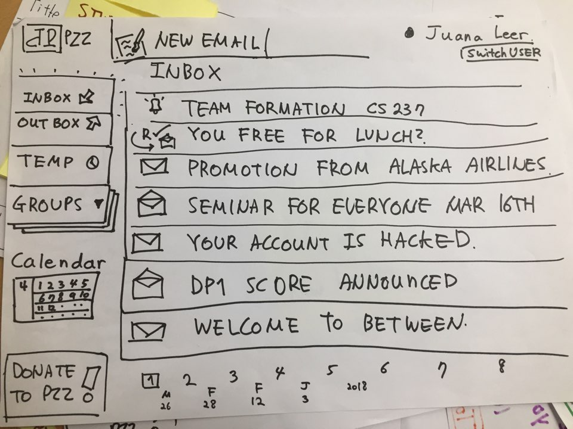
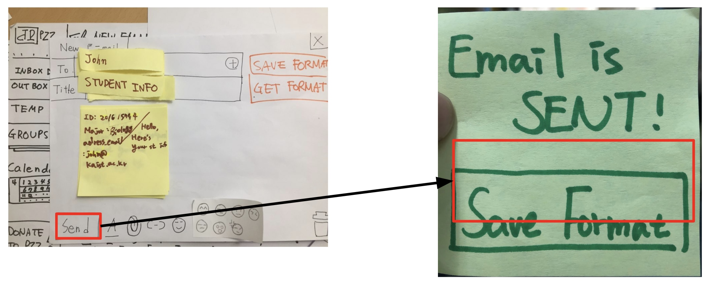
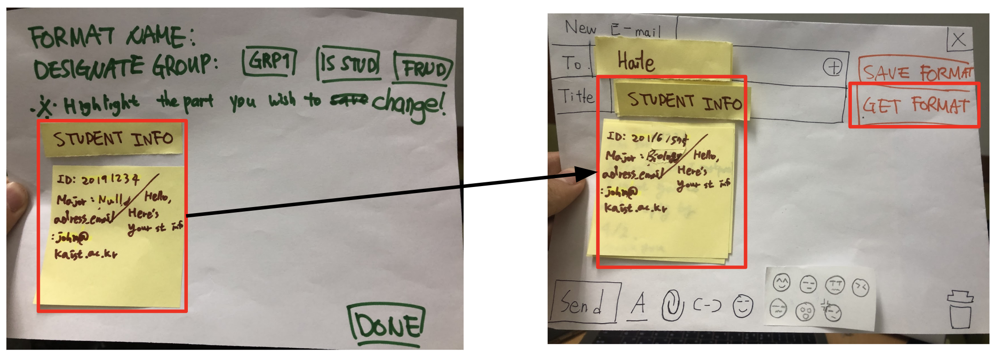
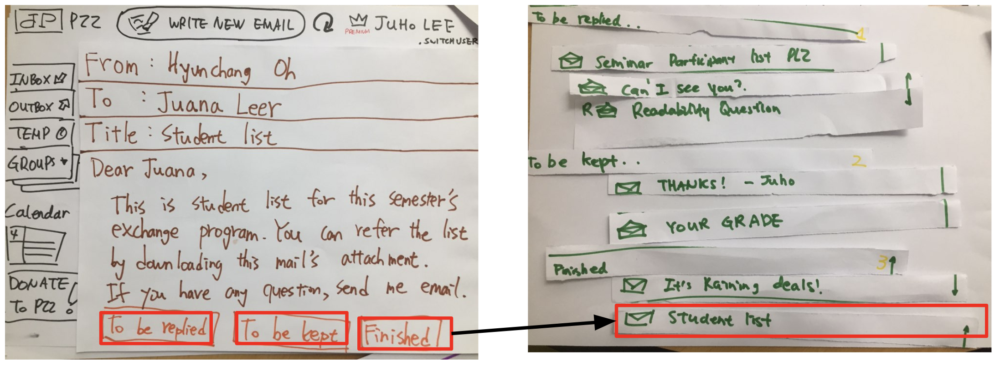
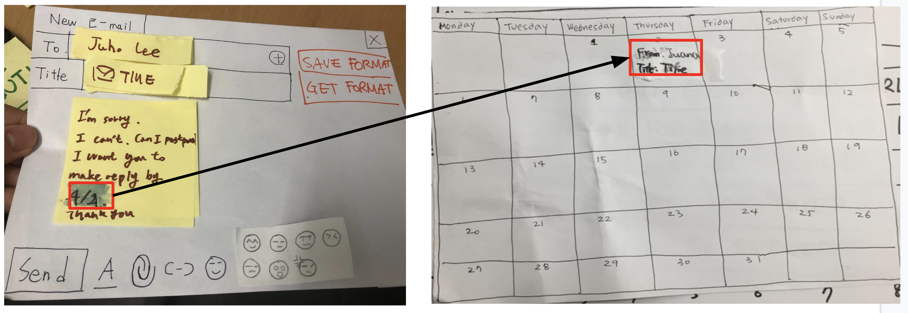

  
**Team. PoZangZee**  
Jeongeon Park, Changhyeon Park, Juan Lee, Hyunchang Oh  
2019 Spring, CS374 Introduction to HCI

# DP3. Paper Prototyping

## Briefing
  
Dear User,  
The following is the main page of an **anonymous email platform(familiar UI)**.  
You are going to be Juana Leer, a 34-year-old **administrative officer(background information)** who sends many, many emails to professors, students, and other people. To help Juana in her works in sending and keeping track of emails, we developed several new features to **increase efficiency and decrease the likeliness to make mistakes(purpose)**. Enjoy!  
Best Regards,  
PoZangZee  
> the computer can be slow   
> any type of mouse movements are possible

## Tasks
* Task 1
> You have to **send different information to a list of people** on the given list.  
> Use the format saving & format using system to send emails.
* Task 2
> There are seven unread emails in your inbox.  
> You have to **read and label each of them** with the labels given on the bottom.  
> Click the group button to see how the emails are sorted.  
* Task 3
> You have to **reschedule an appointment** you made with the professor.  
> Send an email including the reply due date.  
> After the professor checks the email, check out both people’s calendar.  

## Prototype

### Task 1: Email Auto-formating
  
When we click *Send* button after writing the mail, the *Save Format* buttion appeared.
  
By highlighting the part we want to change we can create format easily, and also can use them whenever we write new email.  
The part will be auto-selected on the email format, so that user may easily change the email contents.

### Task 2: Email Labeling & Grouping
  
Just after reading the email, user can classify the email regarding its states. The states might include *To be replied*, *To be kept*, or *Finished*. Those classified emails are viewed at once, and user can easily change their state by drag & drop.

### Task 3: Auto reply due date detector & uploading on calendar
  
When user write an email, the dates are automatically detected. So, when the recipient read the mail, the dates are automatically added to both users' calender so that users can easily manage their replies.

## Participants

### KAIST Times reporter
> KAIST Undergrad, 22, SoC and Biology, born in S.Korea

Requests interviews and materials for newspaper via emails
* Q1. How often do you send email? 
  * 10 times per a week 
* Q2. Do you have formats?
  * Saves previously sent email to MS document, use them as a format for next email.
* Q3. How do you manage your recipients into groups?
  * Does not use grouping

### ICISTS International Conference Head of PR
> KAIST Undergrad, 21, CBE, born in S.Korea

Contact with other college students, organizations, and administrative office.
* Q1. How often do you send email?
  * 10 per a week
* Q2. Do you have format?
  * Yes. For business purpose, I use a few format that i made with my teammates.
* Q3. How do you manage your recipient into group?
  * I don’t make groups

### KAIST Herald reporter
> KAIST Undergrad, 22, SoC, born in S.Korea

Asks for Interviews and materials for newspaper, receives and replies to voices of the people
* Q1. How often do you send email? 
  * avg 2~3 per a day. Up to 10 mails per a day.
* Q2. Do you have formats?
  * No. Choose proper phrase among several things in mind.
* Q3. How do you manage your recipients into groups?
  * Manages address books for groups of 30~40

## Observation
> **How we classify the problems**: Those issues that critically hamper the successful execution of the key functionality that we opt to provide via the service have been classified as highly critical and feedback that regards such an issue has been given high criticality.  
> **How we will solve**: The primary rule and reason that underlies all of the decisions regarding distribution and allocation of resources including but not limited to our time and effort and determining the priority through which the order of implementation of features will be set in cases of contradicting demands from the users is the order of criticality that was assigned to each of the users needs that have been discovered in the course of observation that took place during our paper prototyping and each test to the users who are chosen to resemble our model persona as much as we and our pool of human resources and relations could afford in due time.

### Theme A: affordance.
* Task 1 (The **Formatting** Feature)
  * **High**: P2 coudn’t find ‘New email button’
  * **Mid**: P2 had difficulty choosing the group name. 
  * **High**: P1 had difficulty finding the ‘close’ button. 
  * **High**: P2: “highlight the parts that is saved, or will be changed?”
* Task 2 (The **Categorizing** Feature)
  * **High**: P2 ‘Group’ may not be a good name for the feature
  * **Mid**: P3 asked if the mail gets deleted if it is sent to the ‘Finished’ group.
  * **High**: All was very familiar with the Drag&Drop, even without explanation
* Task 3 (The **Calendar** Feature)
  * **Mid**: P2 got confused of on which criteria the dates were selected as due dates.

### Theme B: Customization + More Suggestions
* Task 1 (The **Formatting** Feature)
  * **Low**: P3 tried to send the email to multiple recipients, by stacking their names.
  * **High**: P1 & P3 asked for the formatting feature to be coordinated with MS excel or similar.
  * **Low**: P1 tried to convert the viewport to another by using “Alt+Tab”
* Task 2 (The **Categorizing** Feature)
  * **Mid**: P3 tried to categorize the emails just by looking at the titles, before opening them.
* Task 3 (The **Calendar** Feature)
  * **Mid**: P3 wished to change the calendar design (changed the colour of the tags, post things other than those from emails, etc.)

### Theme C: Instant feedback of the computer.
* Task 1 (The Formatting Feature)
  * **Mid**: P2 got confused when the email was sent, but there was no feedback.
* Task 2 (The Categorizing Feature)
  * -
* Task 3 (The Calendar Feature) 
  * **Mid**: P3 wished to know if the mail posted on the calendar was replied.
  * **Mid**: P2 wished to know when the mail has been updated on the calendar, before visiting it.

# Feedback of DP3. Paper Prototyping
Overall Reflection: We were very pleased to get many *liked* feedback, and we will do our best for our potential-future target users =)  
We got some interesting *what if* suggestions which worth discussing. These feedback can be critical in some cases, so we decided to talk more about this. Also, some people said we need more detailed explanation, and we promise we will do better! Thank you!

## Individual Reflection
###Jeongeon Park
###Changhyeon Park
###Juan Lee
###Hyunchang Oh  

## Feedback from Studio
**People liked …**
* Explain about briefing part using e-mail form.
* that you explain all possible actions to users.
* how you explain your task is very clear and complex enough for users
* how you made it look like the popular emailing services, +1 for learnability 
* you provide a good background information for user.
* you include emojis in mail editor XD
* nice service of the grouping feature
* nice categorizing by theme
> Thank you for your kind I-like feedback!  
> We will do our best for the time when you become heavy email user.

**People wished ...**
* can it be served for users who send mails for one-many receivers?
> Yes it can! The entire system is designed for one-may receivers. If you don't mind, can you elaborate your question at the next studio? We want to listen more about this!
* you could explain more about the “categorization by name just by looking”, do you mean filtering by name like in other mailing services?
> Sometimes, we may know or guess the contents of email, especially for the case the mail is coming from important person or the title contains meaningless keyword. This is what meant for *categorization by name just by looking*.  
> One of our user suggested this issue and we thought this is important for efficiency, so we introduced it!
* I like the details on your observations, but it would be great if you could also mention about how you would address them, or the possible reason behind them.
> Thank you for telling us this important issue, and we solved it! We wrote the reason why we divided the *high*, *mid*, and *low* on the top of the observation. Thank you!

**What if ...**
* What if ask to user about importance of the schedule in the email before adding into the calendar? It can be quite annoying to user if all schedules containing date info add into the calendar automatically. 
> This is very interesting issue and also dilemma for us. This may be necessary for safety issue but may lower the efficiency. We've thought about *add first - notify - provide undo* as we learned in the class. Thank you for reminding this important issue for us, we will talk more about this.
* you use tagging (like Dr. Papper do) for the recipient groups
> I like your idea! Unlike to the existing mailbox interface, this may help users more easily handle their emails. Just like to our categorizing solution, we will talk more about your idea. Thank you!

**And others**
* if there are a lot dates in email than what happen?
> In current step of prototype, all the dates will be added on the calendar. We agreed that this can make some issue since many same texts are viewed on the calendar(may be inefficient to browse schedule). Of course, user must be able to customize his/her own calendar, but we need to talk more about this. Thank you!