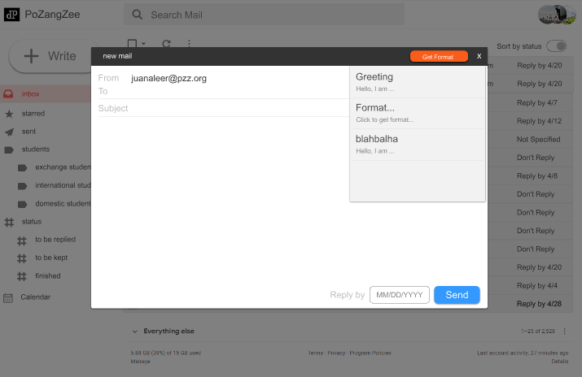
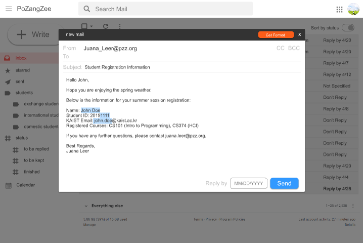
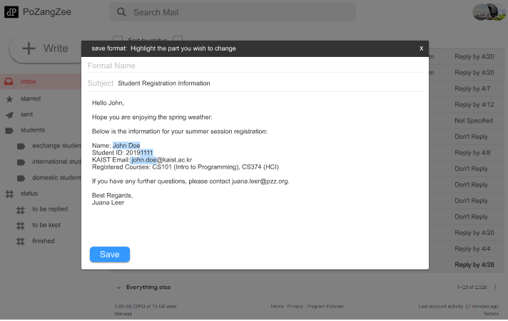
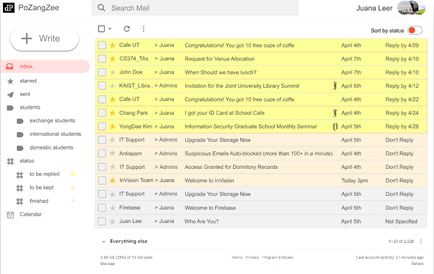
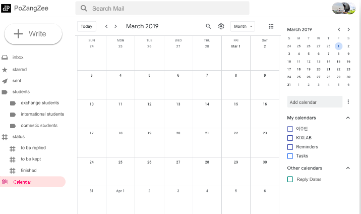

# DP4. Lo-fi Prototyping
-----
### POV
1. When similar emails have to be sent to many different people with little amendments, heavy email users tend to make a format on an external text editors.
2. Heavy email users make mistakes. They sometimes miss an important email, or manage to bring it into attention, but forget to send a reply.
3. For heavy email users, email is an integral part of their job. They need to organise the email as tasks in a timely manner.
---
### Tasks
1. You have to send different information to a list of people on the given list. Use the format saving & format using system to send emails.
2. There are many emails in your inbox. Use the "sort by status" function to sort them according to their importance. 
3. Visit the calendear page, where you can see the emails arranged by their 'reply-by dates'
---
### Prototype
https://docs.google.com/presentation/d/1JyZXyHhEondV8aKsEeLZF-GSeSsEHYziGjfCwz5jm1s/edit#slide=id.g55a358673d_0_24
suggested walkthrough for those without much time to explore:
write (left-top) --> get format (right-top, orange button) --> Greeting (the dropdown list) --> send (right bottom)--> save format (left bottom) --> save --> sort by status (on, right-top) --> sort by status (off) --> calendar (bottom of the left menu bar) --> Done!

##### Platform
We got the InVision app installed and used it to build our lo-fi prototype.

What Worked out Well: One of the best functions of InVision is the ability to link different screens by specifying trigger conditions among the wide variety of options available.

What Didn't Work out Well: Drawing figures, especially with the lines, were somewhat counter-intuitive. We had to spend quite a lot of time learning how to build the most basic diagrams.

##### What we Chose not to Implement

1. the individual emails that were in the inbox. We thought it would be a waste of time to come up with all the fake contents for the emails in the inbox, and it would be straightforward for the users to imagine what would it be like to read those emails.
2. the group-mailbox, sent(outbox), status-mailbox. In the final production, they will be presented in a very similar manner to the inbox. The 'sort by status' function was something special about the inbox, so we decided to exemplify our layout with the inbox, in addition to that it is the first page that appears to users in most email apps.
---
### Screenshots
#### *bold* Task 1
Imagin you have to send many similar emails to a list of recipients. Use the format feature to do this efficiently. 

User has clicked the 'get format' button to retrieve formats.

Format has been loaded to the writing window. The first highlighted part receives autofocus. User may press TAB to switch to next highlighted part. On focus, the highlighted part is emptied. The user can also click on random place to change whatever they wish to.

After sending the mail, the user can click on the save format button that will appear along with the message telling that the mail has been sent. The user can highlight the parts that are more likely to be changed to create format.

#### *bold* Task 2
There are many emails in your inbox. Use the "sort by status" function to sort them according to their importance

The user can click on the "sort-by-status" toggle button to toggle between normal view (arranged in the order of recieved date, recent on top) and sort-by-status view. The sort-by-status view is arranged in the order of presumed importance. The yellow section on top is for those that require a reply, and those with more recent reply-by dates are placed on top. If reply-by dates are same, starred emails appear at the top. If there are more than on starred or non-starred emails that have the same reply-by-dates, they are arranged in the order of received dates, recent on top. The orange section in the middle is for the mails that have been designated as 'to be kept' by the user. The grey section at the bottom is for the mails that have "Don't Reply" as reply date, or have not specified the reply date, (or have a reply date but already been replied by the user), but have not been designated as 'to be kept' by the user.

#### *bold* Task 3
Send the email with the reply dates. Visit the calendear page, where you can see the emails arranged by their 'reply-by dates'

The user can view their calendar here. The calendar can be used like Google Calendar as an schedule organiser. The user can click on the "Reply Dates" checkbox to make the email reply-by dates appear on calendar

---
### Observations
*bold* P1: 
Works at a bank. Sends emails to customers (personal users and companies) and other workers at the bank.
*bold* P2: 
Works as a secretary at an educational charity corporation. Sends emails to students, schools admins, and teachers to advertise and receive applicants for charity programs and many other purposes.
*bold* P3: 
in a diplomatic position, interacts with officers around the world, promotes Korean food

The following includes the observations that we spotted from the users while performing the given tasks, but also some interesting insights we have gained by the users' comments. As all of the participants have not been met in previous DPs, we encountered many new approaches to the main point of views. 

#### Observations - Affordances
1. It was difficult to notice that the circular images at right top side were supposed to mean there are multiple accounts. It was confusing to show the mails sent to those accounts altogether, especially when you can switch between them. (P3)
Solution: How about just showing the photo of the currently activated single account, and when clicked, support "switch account" function, and show the mails sent to that single account only.
Criticality: Medium

2. It was difficult to perceive the meaning of the 'to be kept' status. (P2,P3) P3 recommended to change it to a 'save' function. 
Solution: Along with observation #9, it may be necessary to create an 'archive' function. We have to figure out whether this should be merged with the 'starred' mailbox.
Criticality: High

3. Users looked at the top sections first when asked to set the reply-until dates. (P1, P3) 
Solution: We should consider relocating the reply-until dates to the top, near to the to- and title section.
Criticality: High

4. Some users thought they could not change the non-highlighted part of the format. (P1, P2)
Solution: We believe this issue to be improved in mid-type prototype, when users can actually type stuff. Noticing that the cursor may be placed on non-highlighted parts, the users will likely know that they can change this part, too. We shall see how this works in later user tests.
Criticality: High 

5. A user expected the formats to be organised into the same groups as the mailboxes are. (P1) Another user wished for a categorizing function available to the formats (P3) 
Solution: We do not believe it is necessary to fix the formats in the same organisation as the mailboxes, but it will be helpful indeed to provide the categorizing function to the format. 
Criticality: High

#### Observations - Customization +

6. A user commented that email is most frequently used for international communications (as different countries often do not share the same messanger app, nor do they lie in the same time zone, which makes instant messaging more difficult.) While this may not be true for other users, it would be great to make features for the issues that may arise in international communications.(P1)
Solution: How about showing the local time of the recipient (by tracking the mails that were sent by that recipient previously)? This may or may not help the users predict when the email is likely to be read.
Criticality: Low

7. A user questioned the meaning of calendar function, and instead suggested a pop-up that tells you about the most urgent emails. (P3)
Solution: This was one of the ideas that had been discussed, but not implemented in lo-fi prototype. We should consider implementing this function more seriously.
Criticality: Medium

8. Calendar may be useful to check the user's schedule quickly, especially when making a new schedule by email. It would be good if calendear could be visited while writing the email. (P2)
Solution: We can add the link to calendar in the writing email window. We are also thinking of making the app able to auto-detect any dates written in the window, and inform the user if there is any contradicting schedule in the calendar.
Criticality: Medium

9. "Sent" or "outbox" is mostly used for 'archiving function', as a proof that the user has sent that particular email with what content. (P2) 
Solution: Along with observation #2, we should consider creating an 'archive' function. 

10. A user commented on the format function as unnecessary for short emails and that instant messaging has many advantages over emails. (P1)
Solution: Many other mail apps provide link to instant messaging. We should see how frequent they are used by the users, and if there are any usability issues with them. There is a lot of research coming up ahead.
Criticality: Low

---
### Paper vs. Digital
(1) Usability issues
Regrettably, few links from page to page slipped out of our attention and confused our users. In higher fideity prototypes, this kind of issue must not happen again. Using component-centric tools like ReactJS may help.
In the lo-fi prototype, only the pages that were necessary for the given tasks were implemented. It would have been nicer if we provided some basic functions (like reading a mail from an inbox) to give users the opportunity to play around with the UI and give them a more complete Pozangzee experience. This could have revealed more of critical usability issues that we have missed.

(2) Participants' Reaction and Expectation to Prototypes
The participants expected the prototype to have many missing pages and unfunctional buttons in the paper prototype, and were less surprised when they bumped into yet-to-be implemented features. However, most of them had higher expectation for lo-fi prototype as it was implemented on a computer. While it was still true that the digital prototype had a lesser breadth of implementation of paper, the participants still got more surprised when they met an unfunctional function. 

(3) Changes we made in the digital prototype based on the feedback from your paper prototyping testing
- Categorisation, or Status Presentation
There was a feedback from the studio that suggested to make it possible to change the status of the mails in the inbox without having to actually open that email. While addressing this issue, we discovered that it does not necessarily require user's decision on setting the status to the mails. The solution that we came up was to make the app do the categorisation for the user. In the user testing for the low-fi prototype, all of the participants were satisfied with that function. We plan to stick to the current setting, except for a possible minor amendments to how the status (or previously called categories) should be named.
- Calendar and Date Auto-Detection
We mentioned about our plan to make the app auto-detect whatever dates that appear on the email and automatically add to the calendar. This plan is not only difficult to be technically implemented, but also was objected by many feedbacks. We modified this to just adding the reply-by dates to the calendar. The user may add or dis-add this, just like they would do for different group of dates on the google calendar. 

----
## Feedbacks from Studio
#### People liked..
- that we re-summarised our POV, tasks, and observation, much of which were handed over from last DP
- how we grouped our issues into customization and affordance.
- the 'save format' function itself and its instant feedback
| Thank you all for your kind feedback. We will make sure the features you liked about our presentation is not lost in later development.

#### People wished..
- that it is possible to create format without sending a mail
| We will make it happend in mid-fi prototype. Thank you.
- that the month shown by the calendar may be chosen directly, rather than having to find by arrows.
| We will make that happen. Thanks.
- the additional functions stand out more from the Gmail features.
| the prototype does look much like Gmail. As this has become an issue on later feedbacks as well, we will consider making a similarly-efficient design concept that is distinguishable enough from Gmail. Indeed, our unique features will be placed in a noticable way.
- for a bigger font size for the demo
| We agree that it was difficult to read them. We will make it larger.
- that the calendar function is made more distinguishable from regular calendar
| The calendar does include all features of a google calendear (if that was what 'regular calendar' is supposed to mean). We do agree that the mail deadline feature on calendar should be made more noticable.
- that it is possible to create a format from an existing email
| Sure, we will make that happen. (We have not made the 'reading mail' UI yet. When we build it in mid-fi prototype, we will include this.)

#### People pointed out (what if +)..
- that a user may forget to modify a content of the format (i.e. a user forget to change the title)
| In our prototype, the title was not highlighted, and may be missed as you said. In that particular format-example, the title was supposed to not change between mail to mail. The user can indeed highlight the title too. Also, we have brought the 'send' button to the bottom of the page to increase safety (so that user visits the button after scanning through all of the content). If the safety issue rises to be a concern in future user tests, we will come up with a way to solve it.
- that users may be confused because the UI looks so much like Gmail
| We first thought that making the app similar to Gmail would help the users adjust to the standard email features. Also, the users would have to somehow sign-in to Pozangzee, so we believed they would know what they are doing. However, we do agree that this may appear like 'copying' the Gmail UI and that is not only possible to cause confusion, but also likely to cause future disputes. (probably not in the in-class level, but it is always good to think beyond) We will try to extract the beneficial elements of the Gmail design, and build our unique features on top of it to create something more distinguishable from Gmail. 

