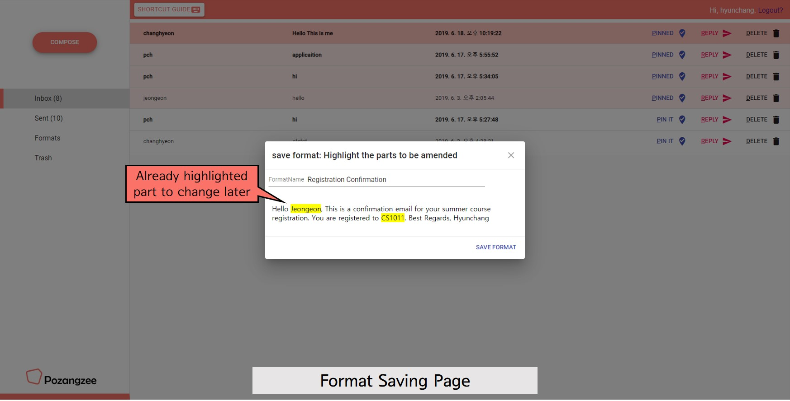
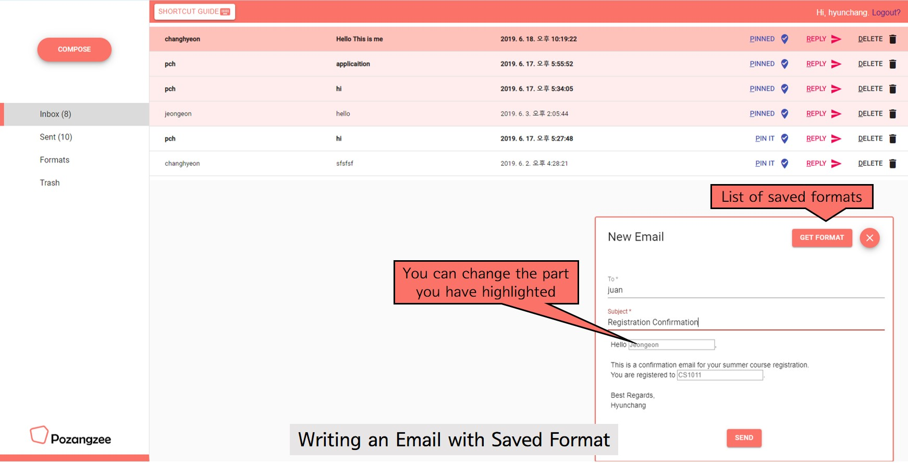
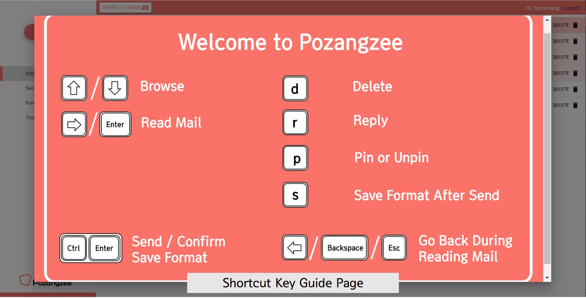

# DP8. Iteration & Wrap-up

------

## Final Interface

#### Video URL: https://youtu.be/wG7Is5893oQ

### Representative screenshots

### Quality arguments

We aimed to improve the currently existing email system, even though there are so many out there already. It was meaningful in that so many people may benefit from attempts like ours, and in that it was brave for a student project to challenge the currently existing email platforms. But then, there is no great leap without bravery!

What is good about student project is that not only the value of the product is appreciated, but also the efforts we put into. We first implemented the existing email system, and began to build our interface on top of that. During the presentation & wrap-up session, Professor Juho Kim commented, "Did you build the whole email system?" *Yes, we did* - and it was surely a lot of work.

One big distinction between other email apps and ours is that *Pozangzee.com* is much simpler in terms of UI and function, thus easier to learn. People do not normally exploit all of the features built into the email app, at which point those features turn no longer helpful, but irritating. We focused on the very core functions of an email system and made the emails work in how it is supposed to work, in a much more effective way. We carefully chose our primary color - *living coral*, and tried to limit the number of colors in *Pozangzee.com*. This is consistent with the simplified number of functions, and makes the overall email system look very neat.

There are stars and tags offered in common email systems to help users organize their Inbox, but we do not usually see *pins* in email systems. *Pozangzee.com* automatically pins all newly arrived emails (to crave for the user's attention), and unpins those that have received the attention it deserves (for example, when replied). Once the email is pinned, it is automatically sorted to the top of the page, and you will never miss it! Of course, all the toggling can be done manually as well. Choosing the right name for this function was the biggest challenge as there were many confusions, but through numerous iterations, we were able to choose the exact term - *Pinned* and *Pin-it*. It is simple, but useful.

The *format saving function* is another brand-new feature that we brought to the world of emails. During the problem-finding session, many interviewees pointed out the need of having formats saved to use for later. The implementation part was not easy since there were no references in ReactJS for highlighting an already sent context, and saving the highlighted information. But that is what makes this function unique! It is also the feature that received the greatest welcome from the users. It saves a great deal of time when sending similar emails to whole lot of people.

Then, there are the *shortcut keys*. There are some systems that employ short keys, but not even nearly as extensively as *Pozangzee.com*. Our email system targets email users with frequent and diverse email uses. Being extensive users of computers (since we all are CS majors), we all know how much short keys can shorten our working time. We aimed to create an email system that requires as less mouse input as possible, and you can check that out by using the shortcut keys we provide.

Lastly, the logo! A famous writer Kahlil Gibran once said, "We live only to discover beauty. All else is a form of waiting." There is that beauty right there in our logo ;-)

------

## Iteration

Through the DP7: user testing process, we found two major problems in our interface - minor bugs and affordance problems. We spent the DP8 time to fix the problems we stated during DP7 and tested an extra user to see if the problem was fixed.

For minor bugs, we tried to make our interface as complete as we can. To avoid the frustration we had during the DP7 user testing, we found as many bugs as possible, and was able to fix most of them. Some of the bugs included no format showing when *Format* button was clicked, shortcut keys working on the background while writing a new email, invalid emails showing up for no reason, and the highlighting malfunctioning sometimes.

For affordance problems, where were two major issues we noticed. The first problem was that the shortcut key instruction button was not easily seen. To fix the problem, we changed the shape and the color (changed from coral to white) and included a keyboard icon so that the user can easily find the instruction during the task. As a result, another user we tested had no problem finding the button. The second problem was how the keyboard shortcut was displayed. For example, some users thought to go back, they had to press left arrow, backspace, and esc *at the same time*. We included a slash in between to make the instructions more easily understood.

------

## Individual Reflection

Juan Lee

We all know that it is very difficult to evenly contribute to the project for the teamwork. However, I was really happy to make this possible through team Pozangzee. Every member has their own specialties, such as Hyunchang’s visual sketching and fast prototyping, Changhyeon’s stable codes and algorithmic thoughts, and Jeongeon’s insights for users and ability for project management. Of course, enthusiasm comes from everyone. From this stable basis of the team and the enthusiastic atmosphere of the team, I could also contribute to the project by implementing parts of a web prototype, designing a low-fi prototype with inVision studio and participating in the ideation stage.

-----

The variety of abilities mentioned above and the convergence of them worked very well in my team. Since we improved an existing email interface, which is very familiar to target users, we have a lot of things to do compared to other solutions. For example, we needed to implement the basis of the email system, such as email protocols, mailing lists, or accounts, maintain the user experience of the target users, and give some extra features of our own. I am sure that if we were four developing experts, we cannot overcome those features. The variety helped us discuss more, think more, and ideate more about our project, which finally solves the problems.

However, with the variety of abilities comes the huge time to discuss. For example, we have talked about the users’ needs until the mid-fi prototype, have re-implemented the prototype several times, and have written and changed the codes many times. In order to overcome this hurdle, we had to spend more time to make the idea clearer. So, at the beginning of every milestone before the mid-fi, we always discussed again our project from the very first -- the needs.

So, through the teamwork, I learned that a better result could come from four developing experts but the best result would come from four people from different areas and how they interact. I was very amazed after I wrote this because this is exactly what we learned from the course; weak person + weak machine + strong process is better than a strong person + strong machine + weak process. 

-----

When I design a UI or work on a project solely, it is easy to confuse me as a designer and me as a user. This makes it difficult to figure out real user’s needs so that a designer often misunderstand users. However, as a team, it helped to avoid being confused because there are four designers, four users, and four different experiences about the project. I could always update refresh users’ thought if I see the other three members of my team. Also, it was a good time to remind me that the user is always right. Since the designers are always more familiar with the project than users, they tend to think the project in the aspect of the expert users. By the iteration and team-based discussion, we could high the standard of usability, learnability, and readability. 

I learned not only the user-centered design but also the collaborative web-based GUI development. Even if this is not the very first time to work together to develop a web-based GUI, but it was a good chance to apply many new team-based development techniques for me. We have discussed and planned on the shared Google docs and shared design tools, coded using collaborative version control system like git and github, and summarized the result with Google Slides. The development itself does not mean only the code but includes all the steps involved in the final outcome. I learned how to collaboratively code, plan, discuss, and summarize the result.

-----

### Hyunchang Oh

The team was great in that everyone kept their enthusiasm high throughout the entire course. In most part of the design project, the tasks were those that did not require any specific skill sets, but more of enthusiasm. Those include ideation, interviews for user needs, and most of the process until low-fi prototyping.

Everyone actively participated in searching for interviewees and brought persons of unique backgrounds. Interviewees of diverse backgrounds helped identifying the needs from various perspectives and building a concise insight.

All of the ideation process was done with all member physically attendant. In most of team work that I have participated in other courses, clubs, etc., the most difficult part was to get everyone together. It takes longer to bring about an idea with fewer members, and even longer to explain it to the rest of the members. With this team, however, this burden never happened. Together we built great ideas that we all agreed upon and proceeded quickly. 

Everyone possessed unique skill sets that contributed a lot to the project. From mid-fi prototype, the tasks began to demand in-depth implementation skills, along with more serious communication skills. 
As always, some were more experienced than the other, and I was more to the latter than the former when it came to higher fidelity implementation. While everyone participated equally in designing the UI, we separated the tasks into roughly four and assigned to each member. I worked on implementing the read-mail UI and short keys. They were one of the core functions, but I have to admit they were easier to implement than others. Getting familiar with ReactJS, the tool that I never used before, was one hurdle, and overcoming my not-so-in-depth background in general was another. Other members would insist I managed to overcome with my own efforts, but I must thank them for their kind guidance. They did not do my part by themselves, but enabled me to do it myself, thus I am grateful. I worked more on writing reports, preparing for presentation, and making the video to contribute to the team. I learned that I do not always have to be excel at everything, but must possess one or few skills that can contribute to the team in exchange for the skills I owe. I wish this skill to be implementation skills with consideration of HCI in next teamwork, and I will push harder this summer to achieve this goal next semester.

What did not go well with our team, was in the methodology rather the team itself. At first half of the semester, we assigned the main manager for each DP. Although we always did the discussion together, there was one person to actually prepare the slides and write the report. All four of us were assigned for different DPs so that the overall distribution of work was roughly equal. While we expected this to increase the efficiency, it brought down the overall quality of the reports by placing too much burden on one person. We quitted dividing the work as such after the midterm. 

-----

The most important thing I learned through the design projects was that I must never assume anything about the user. In our project, we made an email app. I am a frequent email user myself, but my guess about users’ need for emails was almost always wrong. I underestimated its value at first, but now I know that efforts must be made for identifying the needs directly from the users.

ReactJS was a good tool, but was not suitable for our project. It is organised as components, so it is easy to change all pages if there is a shared component between pages. However, we did not have that many pages, but there were many occasion in which the components have to communicate with each other. I think using pure JS would have been much easier. It was good to try a new tool, but I learned that it is very important to choose the best tool when it comes to implementing web-based GUI implementation, as there are just so many of them.

-----

### Changhyeon Park

HCI course was very helpful in terms of experiencing design process that can be used in practical work as well as studying theoretical aspects of this area. Team-based design project was essence of this class and it would be one of the most valuable experience among the educations that I have taken in this college. My team consisted of four members who have the common major computer science. Some of us met each other for the first time in this team, but I felt that there’s no difficulty to work as a team due to that factor. 

I think we distributed our work well and all member carried out their duty. I’m satisfied that all other members have sense of responsibility. For every DP, every member participated in the process as well as preparing the presentation. Before I took this class, I expected that UI implementation part would be the most time-consuming. However, it took no much time as I worried in advance. We sufficiently discussed about the design of our webpage before started the implementation. Our initial target user ‘heavy email users’ was not clear, and we discussed about it and made it clear enough. I think that it was great to clarify the target user before implementation. If target user definition was too ambiguous, GUI wasn’t oriented to real user as this class intended. We carried out overall process well, but there’s also difficulties as well. After combining each member’s implementation part, we weren’t concerned about possible problems when using our system. Minor implementation errors arose and it sometimes didn’t function as we intended. 

Also, some members (including me) were not familiar with writing comment for each function, others had some difficulty to understand other code. We had meeting to deal with such problems and solved it by implementing that part together. I learned a lot of things in the teamwork and it was chance to think about ‘good team’. I think good team is what all members have same motivation. Even if the team has a leader and he or she motivates other members every time, practically a person can’t take care of all people. Also, I thought that same motivation is important in terms of the way they work. For example, if someone is only interested in the grades, he or she must actively participate in the project to satisfy evaluation factor. If other one just wants to make great result, then evaluation is not important factor to consider. Both seem to work very hard, but they may participate in the team project in different attitude.  

We are required to make a GUI ‘not for us’, and I felt that user-centered design is not such easy process. At first, I’m not a target user so I need to understand them. Designer have to figure out user’s needs, the way they deal with their task, common factors as individual, etc. In the early stage of our design process, we had plan to make calendar. However, we noticed that our target users don’t need it in the mail system, so we deleted it in our implementation. I realized that user interview and testing is essential and critical part of user-centered design process. We can expect their needs, but something could be missed or misunderstood when excluding them. It was first time for me to design web-based UI, so I worried about the implementation at the beginning of this semester. I had some trouble to implement by using HTML, CSS, Javascript at the first time, but it was getting better as I used it. We used ‘React’ and some UI toolkit. I’m curious about how the implementation would be done if we didn’t use React. I learned that deciding toolkits and library is also part of implementation process and it could affect efficiency of our work.

-----

### Jeongeon Park

As mentioned in class, I believe having a great team is what matters the most in making a successful project. Luckily, I was able to meet three other teammates who did not drop out, or procrastinate, and I felt like the overall process of the course went very smoothly.

The best part of our team was that we had a cheerful environment where everyone can freely express his or her opinion. Any idea was considered thoughtfully, and whenever the process was deviating from our original direction, someone would cautiously point that out and we would repeat the iteration process to see if we were on the right track. The contribution was almost equal, but everyone's participation was not pressured by the contribution proportion. Many great ideas came up, and *Pozangzee.com* became possible because of this kind of atmosphere.

Nonetheless, we faced difficulty while preparing for the Low-fi DP studio. The struggle took place because everyone was too busy. We did not spend ample time to take into account every variable, and at the time we started to implement, we realized that our core functions were deviating from the POV and the target user. Immediately after realizing the problem, we spent the whole day together trying to start from the very bottom, and through thoughtful discussion and consideration, we were able to get back on the right track. Whenever small problems arose, we would all gather together physically and talk about how to fix the problems, and there were no big, or major difficulties we faced from then on.

Comparing this with previous teamworks I have gone through, I feel like the success came from the fact that everyone *cared* about the course. Because not one person was in charge of keeping track of the overall process, everyone took account the big picture throughout the course. There were no leader and followers, but four leaders. I learned that *similar goals and motivation* is what keeps everyone heading towards the same direction, and that whether I become a leader or a just a teammate in later teamworks, I should try to help create a free atmosphere.

My expectation of this course centered on the implementation of web-based application, but the course was mainly about the user-centered iterative process. A major thing I realized was that what I want to make often is different from what users expect. Even if I liked some of our primary features like "explicitly marking the please-reply-by-this-date when sending a new email", our target users pointed out that it would add pressure to both the email sender and the receiver, giving a deadline-like expression. In some other times, the target users were surprisingly familiar with newly added function, but struggling to understand what shortcut keys meant during the experiment session. Also during the studio sessions, some classmates focused on the functions that we did not even think as crucial. I have never thought in the perspective of users when I created programs before, so this course gave me a valuable lesson about the users.

Regarding the implementation process, I had a little experience in ReactJS, so when our team decided to use ReactJS for the whole implementation, I was glad to gain more experience with the tool. Also, one of the members in our team gave us a guideline on choosing the main UI - material UI, and with the organization of each component of *Pozangzee.com*, I felt that the overall planning for the implementation was very organized. I realized that planning for the implementation is more important than the actual coding part, because planning in details will help with the efficiency of the organization of the web-based coding. Sometimes, as we divided the parts of the component and combined later on, sometimes we had struggles understanding where parts of the components stayed in the code. We then communicated together to put different components together. I feel like ReactJS was a good tool in terms of dividing and collaborating, but not in terms of implementing emails. I wish to gain experience in other tools, and find out which one is the best in terms of email system.